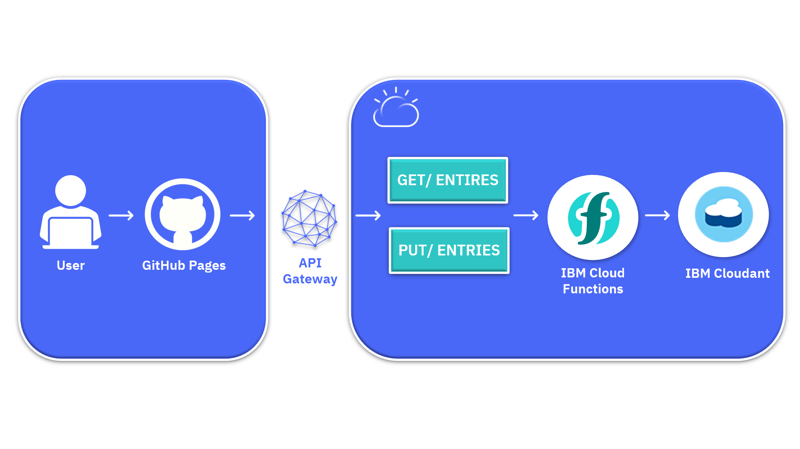

# IBM CLoud Functions: Backend Serverless

En este repositorio encontrará el paso a paso para la creación de un backend serverless de ejemplo utilizando IBM Cloud Functions al cuál se conecta a una base de datos Cloudant. Como se muestra en el diagrama también se hace uso de un frontend desplegado mediante GitHub pages, el cual se utiliza para probar el backend desarrollado. 

Los pasos aca descritos en este repositorio se encuentran en la [documentación de IBM Cloud Functions](https://cloud.ibm.com/docs/solution-tutorials?topic=solution-tutorials-serverless-api-webapp).

 

## ✅ Base de datos 

1. En el buscador de la página de IBM Cloud busque "Cloudant" y cree una nueva instancia. Para esto deberá elegir un nombre único de servicio, un grupo de recursos, una ubicación y un tipo de plan. Adicionalmente seleccione IAM y credenciales heredadas como método de autenticación y finalice este paso seleccionando el botón "crear".

2. Ingrese a la lista de recursos y espere hasta que el estado del servicio cambie a "Provisioned". Luego de esto haga click en "Iniciar panel" y en la nueva pestaña seleccione "Crear base de datos", seleccione No particionado y un nombre único, luego de esto de click en "Crear".

3. Regrese a la pestaña de IBM Cloud donde se encuentra la descripción general de su base de datos y seleccione la pestaña "Credenciales de servicio", cree una nueva credencial con rol de administrador.

## ✅ Acciones en IBM Cloud Functions

Necesitará crear una secuencia, que es una cadena de acciones, por lo que las acciones vinculadas a la secuencia se ejecutarán una tras otra.

1. En el menu de tres barra seleccione "Functions". Encontrará un menú desplegable de espacios de nombres, seleccione o cree uno.
2. Seleccione la pestaña "Acciones", de click en "Crear" y luego seleccione la opción "Action".
3. Ingrese prepare-entry-for-save como nombre, seleccione "Crear paquete" y utilice el nombre "guestbook", elija "Node.js" y seleccione crear. Finalmente reemplace el código existente con el siguiente fragmento de código:

```sh
function main(params) {
  if (!params.name || !params.comment) {
    return Promise.reject({ error: 'no name or comment'});
  }

  return {
    doc: {
      createdAt: new Date(),
       name: params.name,
       email: params.email,
       comment: params.comment
    }
  };
}
```

4. Para agregarla acción a una secuencia haga clic en "Enclosing Sequences" y luego en "add to sequence". Establezca el Nombre de la secuencia en save-guestbook-entry-sequencey elija "guestbook" como paquete y de click en Crear y Agregar.

5. Haga clic en la secuencia guardar-libro-entrada-secuencia para abrir los detalles. Luego haga click en Agregar en la esquina superior derecha. Seleccione "usar público", elija "Cloudant",en acciones, elija crear documento. Cree un nuevo enlace y utilice el nombre "binding-for-guestbook", seleccione su base de datos con las credenciales que ha creado anteriormente.

NOTA: Para probar la secuencia completa, haga clic en "invocar con parámetros" e ingrese el JSON:

```sh
{
     "name": "John Smith",
     "email": "john@smith.com",
     "comment": "this is my comment"
   }
``` 

 6. Nuevamente desde el panel de Funcions cree una nueva acción, use "set-read-input" como nombre. Nuevamente, seleccione "guestbook" como paquete, Nodejs y de click en crear. En los detalles de la acción, reemplace el código existente con el fragmento de código a continuación:

```sh
function main(params) {
  return {
    params: {
      include_docs: true
    }
  };
}
```

7. Nuevamente haga click en "Enclosing Sequences" y luego en "add to sequence" y Crear nueva . Ingrese "read-guestbook-entries-sequence" como nombre de la secuencia y haga click en crear y agregar.

8. Haga click en la secuencia y luego haga click en agregar para crear y agregar la segunda acción para obtener documentos de IBM Cloudant. En Usar público, elija IBM Cloudant y luego enumere los documentos. En My Bindings, elija binding-for-guestbook y Add para crear y agregar esta acción pública a su secuencia.

9. Haga click en Agregar nuevamente para crear y agregar la tercera acción que dará formato a los documentos de IBM Cloudant. En Crear nuevo, ingrese el format-entries nombre y luego haga click en Crear y agregar. Haga clikc en las entradas de formato y reemplace el código con el siguiente:

```sh
const md5 = require('spark-md5');
function main(params) {
  return {
    entries: params.rows.map((row) => { return {
      name: row.doc.name,
      email: row.doc.email,
      comment: row.doc.comment,
      createdAt: row.doc.createdAt,
      icon: (row.doc.email ? `https://secure.gravatar.com/avatar/${md5.hash(row.doc.email.trim().toLowerCase())}?s=64` : null)
    }})
  };
}
```

## ✅ API de IBM Cloud Functions

Para crear una API:

1. Seleccione la secuencia read-guestbook-entries-sequence y haga click en **Web Action**,  marque **Enable as Web Action** y guardade. Haga lo mismo para la secuencia save-guestbook-entry-sequence.

2. Vaya a API y haga clic en Crear API. Establezca el nombre de la API en **guestbook**, y la ruta base en **/guestbook**. Haga click en **Crear operación** y cree las siguientes operaciones:
```sh
Path: /entries
Verb: GET
Action: read-guestbook-entries-sequence
```
```sh
Path: /entries
Verb: PUT
Action: save-guestbook-entry-sequence
```
3. Finalmente cree la API y copie la ruta proporcionada.

## ✅ Aplicación Web

Para probar el backend desarrollado:

1. Clone el presente repositorio en su GitHub personal e ingrese al archivo docs/guestbook.js, en el establesca la variable apiurl por la ruta proporcionada en el API gateway en los pasos anteriores.
2. Guarde y haga tanto el commit como el git push correspondientes para actualizar los cambios en su repositorio.
3. Ingrese en la pestaña  **Configuración** de su repositorio GitHub y en la sección **GitHub pages** modifique el valor **Source** por la carpeta docs e ingrese a la aplicacion mediante la URL proporcionada como **Your site is published at https://julianaleongonzalez.github.io/IBM-Functions-Serverless-App/**

## ✅ Referencias

Los pasos mencionados fueron tomados y adaptados de la documentación de IBM que encontrará en este [link](https://cloud.ibm.com/docs/solution-tutorials?topic=solution-tutorials-serverless-api-webapp)

El frontend utilizado fue tomado y adaptado del GitHub que encontrará en este [link](https://github.com/IBM-Cloud/serverless-guestbook)

## Autores ✒️
IBM Cloud Tech Sales


